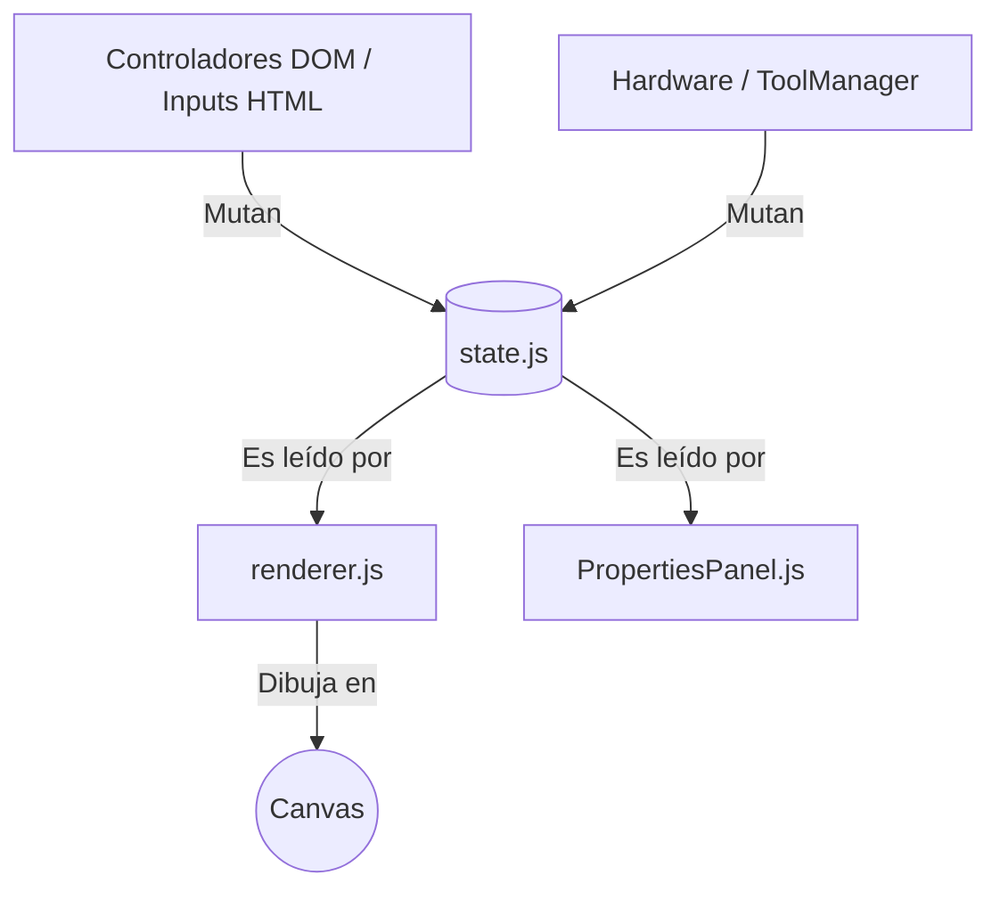
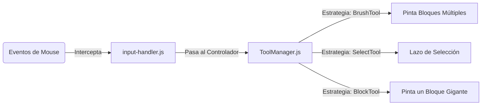

# Documentación Maestra: Constructor de Niveles Web

> [!NOTE]
> Este documento técnico detalla la arquitectura, el flujo de datos y los módulos del Editor de Niveles Web. Está diseñado para servir como manual de referencia definitivo para expandir, depurar y escalar el proyecto sin generar "código espagueti".

---

## FASE 1: Esqueleto Arquitectónico y Estado Global

Tras una refactorización masiva, el proyecto Web transicionó de un modelo fuertemente acoplado (scripts monolíticos inyectados directamente al DOM) a una arquitectura altamente modular inspirada en patrones de diseño como **Strategy** e **Inyección de Dependencias**.

### 1. Jerarquía de Archivos y Responsabilidades

La estructura del directorio actual está hiper-optimizada. Ningún módulo hace el trabajo de otro.

```text
Constructor-de-Niveles-Web-para-Juego-de-Pelota-con-Sensores/
│
├── index.html                 # Punto de entrada. Declara la estructura UI estática sin lógica de negocio.
├── index.css                  # Hoja de estilos principal y tokens de diseño.
│
├── js/
│   ├── editor.js              # Controlador principal. Configura los listeners iniciales del DOM y orquesta la UI, pero DELEGA el resto.
│   ├── state.js               # "Single Source of Truth". Contiene la memoria viva de la app (entidades, historiales, colores).
│   ├── renderer.js            # Bucle de dibujado (60 FPS). Controla la cámara y orquesta a los sub-renderers.
│   ├── entities.js            # Modelo de clases abstractas para la creación inicial de objetos.
│   ├── input-handler.js       # Captura hardware (Mouse/Teclado) y lo pasa al ToolManager.
│   │
│   ├── core/                  # Subsistema del motor puro (sin DOM)
│   │   ├── math.js            # Funciones de álgebra espacial, grillas inteligentes y magnetismo (Snap).
│   │   ├── serializer.js      # Lectura y exportación de archivos JSON (Conexión directa con Android).
│   │   └── transform.js       # Mutación matemática grupal (Alinear, Invertir, Distribuir selecciones).
│   │
│   ├── renderers/             # Subsistema visual (Descentralizado)
│   │   ├── types/             # Un archivo único por cada tipo de entidad (Ej. boss.js, logic_gate.js).
│   │   └── colorUtils.js      # Magia algorítmica: Hashing de linkIds para colorimetría procedimental HSL.
│   │
│   ├── tools/                 # Subsistema de Interactividad (Patrón Strategy)
│   │   ├── ToolManager.js     # Cerebro. Administra el paneo/zoom/escala y pasa la orden a la herramienta actual.
│   │   ├── SelectTool.js      # Estrategia de Selección por "Lasso" y Clics.
│   │   ├── BrushTool.js       # Estrategia de pintura contínua (Arrastrar para pintar).
│   │   └── BlockTool.js       # Estrategia constructora (Arrastrar para dibujar una zona grande).
│   │
│   └── ui/                    # Subsistema de vistas Reactivas
│       ├── OSD.js             # Gestor de notificaciones flotantes (On-Screen Display) seguras.
│       └── PropertiesPanel.js # Actualización bidireccional entre los inputs HTML de la izquierda y el State.
```

---

### 2. El Gestor de Estados (`state.js`)

El corazón de la aplicación. En lugar de estar solicitando información del HTML constantemente (e.g. `document.getElementById('inputX').value`), el motor opera con **Manejo de Estado Centralizado**.

#### El concepto de "Single Source of Truth" (Única Fuente de Verdad)

Todos los módulos del proyecto (Renderizado, Matemáticas, UI) leen y escriben en un único objeto global `state`.



#### Estructura Interna del State

> [!IMPORTANT]
> El objeto de estado NUNCA almacena instancias del DOM. Solo almacena números, strings y arreglos llanos, lo que permite que sea súper rápido, serializable para Undo/Redo y fácil de exportar a JSON.

* **`entities`**: Arreglo central que contiene los objetos puros del juego listos para ser renderizados.
* **`selectedIds`**: Arreglo de *Strings* (IDs) que denota qué elementos en `entities` están seleccionados. El motor de dibujado hace *polling* contra este array para saber si aplica animaciones de selección.
* **`history` / `historyIndex`**: Pilas de memoria que contienen copias profundas (`JSON.stringify`) de `entities` para la función nativa de Deshacer/Rehacer (Ctrl+Z).
* **`themes`**: Gran diccionario de tokens de diseño. Contiene paletas completas para *Neon*, *Volcano*, *Industrial*, etc.

#### La función `saveState()`

Esencial para el sistema Undo/Redo. En lugar de rastrear mutaciones granulares complejas, cada que una herramienta finaliza una acción destructiva/constructiva (Ej: Terminar de arrastrar un muro, soltar el mouse tras pintar), dispara esta función para pushear una foto completa del nivel al historial de memoria temporal.

## FASE 2: Motor de Renderizado Modular

El Editor no confía en el DOM para renderizar niveles complejos (sería demasiado lento para 30,000 bloques). En su lugar, utiliza un `CanvasRenderingContext2D` que se repinta hasta 60 veces por segundo en sincronía con la pantalla (`requestAnimationFrame`).

### Arquitectura de `renderer.js`

El controlador de vista central, `renderer.js`, tiene un bucle maestro estricto:

1. **Limpia y escala el lienzo**: Aplica factores de Zoom (`totalZoom`) y traslación de Cámara (`panX`, `panY`).
2. **Pinta la capa base**: Fondo de color temático y rejilla (Grid).
3. **Traza Conexiones Físicas y Lógicas**: Dibuja los cables (curvas de Bézier) entre interruptores y puertas basándose en propiedades compartidas de `linkId`.
4. **Delega el pintado de Entidades**: Recorre `state.entities` y, en lugar de saber cómo se dibuja cada bloque, simplemente llama a la colección modular inyectada.

### Inyección de Renderers (`js/renderers/types/`)

Para evitar un archivo con 2000 líneas de `if/else`, aplicamos **Inyección de Dependencias**. Existe una carpeta dedicada `types/` donde cada archivo sabe cómo dibujarse a sí mismo:

* `boss.js`: Traza polígonos, ojos, escudos rojos y animaciones nativas.
* `moving_wall.js`: Utiliza las matemáticas de tiempo (`Date.now()`) para dibujar previsualizaciones del bloque en movimiento sin que realmente se desplace en memoria.

En la cima del gestor, un diccionario carga todas las librerías gráficas, por ejemplo:

```javascript
const renderers = {
    'boss': drawBoss,
    'moving_wall': drawMovingWall,
    // ...
};
```

### Colorimetría Procedimental (`colorUtils.js`)

Uno de los mayores logros del proyecto es la generación automática de paletas para conexiones lógicas:

1. Toma el texto plano introducido por el usuario (`linkId`, ej. "Puerta01").
2. Transforma los caracteres ASCII en un Hash de encriptación numérico.
3. Lo inyecta en el valor Hue (H) del espectro de colores HSL.

* **Resultado**: Un identificador textual genera un color único matemáticamente perfecto para teñir el switch, la puerta y el láser que los conecta, evitando el trabajo manual de paletas por parte del Diseñador.

---

## FASE 3: El Subsistema de Herramientas (Patrón Strategy)

Los clicks, arrastres y atajos de teclado no mutan el Canvas directamente. Se rigen por el patrón de diseño **Strategy** a través de `ToolManager.js`.



### 1. `ToolManager.js` (El Cerebro Receptor)

Se encarga de resolver acciones agnósticas (acciones que suceden sin importar qué herramienta esté activa):

* Arrastrar el mapa usando Rueda de Mouse o Botón Medio (Pan).
* Zoom in/Zoom out con la Rueda.
* Seleccionar a través de herramientas la que debe estar activa en este momento.

### 2. Clases de Herramientas (`Tool.js` y Derivados)

Todas las herramientas de construcción heredan de la clase base abstracta `Tool`. Esto significa que en el futuro puedes crear `LassoTool.js` y el motor la aceptará porque cumple con los tres contratos obligatorios:

* `onMouseDown()`: Qué pasa cuando hago clic inicial.
* `onMouseMove()`: Qué sucede mientras mantengo el clic y arrastro.
* `onMouseUp()`: Qué mutación se efectúa en memoria cuando suelto el ratón.

**Ejemplo Práctico**: La herramienta `SelectTool.js` dibuja dinámicamente un cuadrado semitransparente sobre el Canvas al arrastrar (`state.tempRect`). Al dispararse `onMouseUp()`, ejecuta una búsqueda por colisión de Área (Bounding Box) contra todo el arreglo de entidades. Aquellas entidades que se sobrepongan al área pasan inmediatamente a poblar el array de `state.selectedIds`, y el redibujado de selección ocurre mágicamente en el siguiente frame sin lag.

## FASE 4: Álgebra Espacial y Matemáticas (`js/core/`)

Para mantener `utils.js` ligero, todas las operaciones pesadas de colisión, geometría y manipulación masiva se aislaron en la carpeta `js/core/`.

### `math.js`

Es la calculadora del juego. Alberga funciones puramente aritméticas o geométricas:

* `getCanvasCoords()`: Traduce los clics del mouse desde la pantalla del navegador (Pixeles crudos) al sistema de coordenadas virtuales del Canvas (afectadas por el Zoom y el Paneo de la cámara).
* `checkSmartGuides()`: Un escáner de proximidad. Revisa si el borde del bloque que estás moviendo está "cerca" (menos de 10 píxeles virtuales) de la fracción matemática del mapa (mitad, tercios, cuartos). Si lo está, "imanta" (hace *snap*) la coordenada del bloque a esa posición y dibuja la línea de guía de la fracción matemática descubierta usando la función auxiliar `gcd()` (Máximo Común Divisor).
* `centerLevel()`: Calcula la Caja Delimitadora (Bounding Box) de todos los bloques existentes y ajusta el Paneo de la cámara para que el nivel quede centrado visualmente en tu monitor.

### `transform.js`

Es el controlador de mutaciones masivas para múltiples bloques seleccionados:

* `alignSelection()`: Toma todos los objetos de `state.selectedIds` y los alinea arriba, al centro, abajo, izquierda o derecha respecto al bloque que funciona como "Ancla" (generalmente el primero o el último seleccionado).
* `distributeSelection()`: Espacia uniformemente un conjunto de bloques calculando la diferencia entre el mínimo y máximo de sus ejes.
* `bringSelectionToFront()` / `sendSelectionToBack()`: Reordena los elementos en el arreglo de `state.entities` alterando su Z-Index de dibujado.

---

## FASE 5: Serialización y Manejo de Archivos (JSON)

El motor exporta la información en un formato agnóstico e idéntico al que requiere el motor Android. Toda esta lógica vive en `js/core/serializer.js`.

### `getLevelJSON()`

Lee las propiedades del nivel actual (Ancho, Alto, Columnas, Tema) y mapea el arreglo `state.entities` purgando valores internos innecesarios o recalculando escalas. Devuelve un texto formateado listo para descarga.

### `updateJSON()`

Hace el proceso inverso. Actualiza la estructura del proyecto en tiempo real cargando el texto desde la ventana Modal de Importación o desde el LocalStorage del navegador, hidratando a `state.entities` con instancias frescas de la clase `Entity` (ver `entities.js`).

**Estructura del Archivo Generado (`.json`)**:

```json
{
    "levelId": 999,
    "theme": "volcano",
    "width": 3840,
    "height": 2160,
    "gridCols": 192,
    "gridRows": 108,
    "entities": [
        {
            "type": "wall",
            "x": 620,
            "y": 1040,
            "w": 320,
            "h": 80
        }
    ]
}
```

*Esta estructura de datos es parseada directamente por el sistema nativo de Android y dibujada 1:1 en el dispositivo móvil.*

---

## FASE 6: Controladores Reactivos del DOM (Subsistema UI)

El Canvas no es el único elemento visual. La barra lateral, los modales y las alertas están escritos en HTML/CSS, y su manipulación se confina a la carpeta `js/ui/`.

### `PropertiesPanel.js`

Actualiza el menú lateral izquierdo cuando haces clic en un objeto.

* **Bidireccionalidad**: Si haces clic en el canvas, este panel lee el `state.selectedIds` y dibuja las propiedades (X, Y, Ancho, Tipo). Si tú modificas los números en el panel HTML con el teclado, este módulo inyecta los valores de regreso a `state.entities` y pide un redibujado instantáneo del Canvas.

### `OSD.js` (On-Screen Display)

El responsable de esos bonitos avisos emergentes flotantes (Toasts).
Su arquitectura es **Auto-Lampiadora**: Antes de inyectar un nuevo div en el DOM, borra su propio contenedor (`container.innerHTML = ''`). De este modo, garantiza que si envías 10 alertas por segundo, el HTML no se congele acumulando nodos huérfanos.

### `rulers.js`

Controla las reglas graduadas visuales en los márgenes Izquierdo y Superior de la ventana. Ajusta los intervalos métricos (de 1/8, 1/4, 1/2) sincronizando sus divisiones con el factor `totalZoom` de la cámara actual.

---
> [!TIP]
> ¡La refactorización es un ciclo, no un destino! El proyecto actual goza de una salud excepcional, desacoplamiento y organización; consérvalo así evitando que `utils.js` o `editor.js` vuelvan a acumular tareas que no les corresponden.
